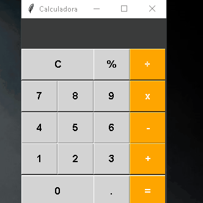

# 🧮 Calculadora em Python com Tkinter

Este é um projeto simples de calculadora que desenvolvi com **Python**, usando a biblioteca **Tkinter** para criar a interface gráfica. A ideia surgiu acompanhando um vídeo do canal [Usando Python | João Futi Muanda](https://www.youtube.com/watch?v=i24MxljM-Bw&list=PLGFzROSPU9oVOK_4OojndjJggKV5ef1nQ), e fui adaptando o projeto ao meu jeito.

## 🎥 Demonstração

Aqui está um GIF da calculadora em funcionamento:

## 📌 Funcionalidades

Ela realiza operações básicas:

- Adição (`+`)
- Subtração (`-`)
- Multiplicação (`x`)
- Divisão (`÷`)
- Porcentagem (`%`)
- Trabalha também com números decimais

Também tem:

- Botão `C` para limpar
- Botão `=` para mostrar o resultado

## 🎨 Interface

A interface é simples e intuitiva. Os botões têm cores que ajudam a identificar as operações, e o layout foi feito com carinho pra facilitar o uso. Além disso, o código está organizado em dois arquivos principais: um pra interface e outro pra lógica da calculadora.

## 📁 Estrutura de arquivos

